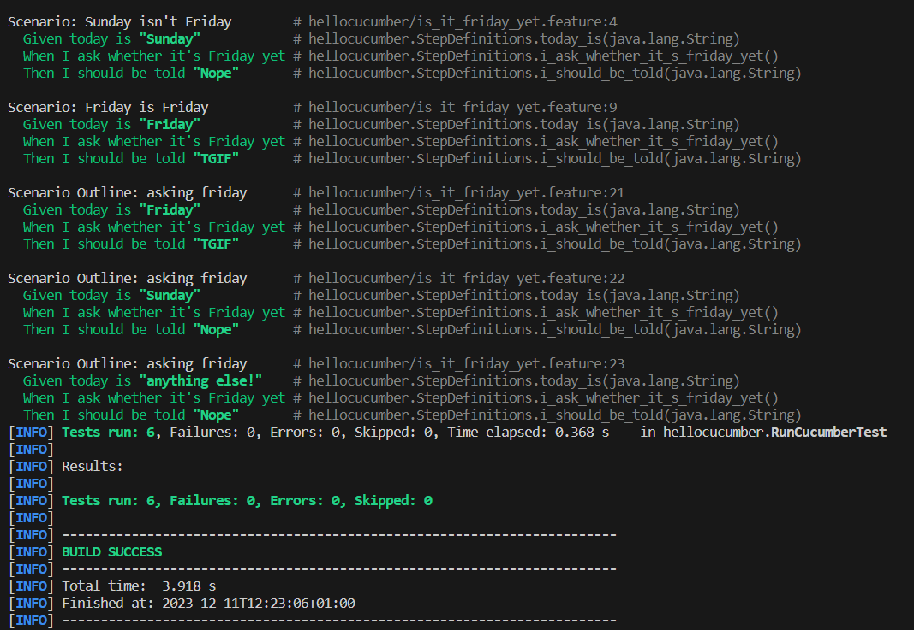
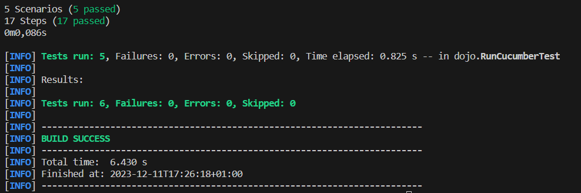

= R5.A.08 -- Dépôt pour les TPs
:icons: font
:MoSCoW: https://fr.wikipedia.org/wiki/M%C3%A9thode_MoSCoW[MoSCoW]

Ce dépôt concerne les rendus de mailto:michele.florio@etu.univ-tlse2.fr[Michele FLORIO].

== TP1

.is_it_friday_yet.feature
[source,java]
---
# language: en
Feature: Is it friday yet ?
    Scenario: Sunday isn't Friday
        Given today is "Sunday"
        When I ask whether it's Friday yet
        Then I should be told "Nope"
    Scenario: Friday is Friday
        Given today is "Friday"
        When I ask whether it's Friday yet
        Then I should be told "TGIF"
    Scenario Outline: asking friday
        Given today is "<day>"
        When I ask whether it's Friday yet
        Then I should be told "<answer>"
        Examples:
            | day            | answer |
            | Friday         | TGIF   |
            | Sunday         | Nope   |
            | anything else! | Nope   |
---

.Résultat de l'exécution des tests

== TP2

.order.java
[source,java]
---
package dojo;
import java.util.ArrayList;
import java.util.List;
public class Order {
    private String owner;
    private String target;
    private List<String> cocktails = new ArrayList<String>();
    private String message;
    public void declareOwner(String owner) {
        this.owner = owner;
    }
    public void declareTarget(String target) {
        this.target = target;
    }
    public List<String> getCocktails() {
        return this.cocktails;
    }
    public void setMessage(String message) {
        this.message = message;
    }
    public String getMessage() {
        return "From " + this.owner + " to " + this.target + ": " + this.message;
    }
}
---

.Résultat de l'exécution des tests

== TP3
