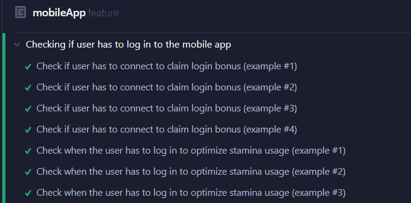
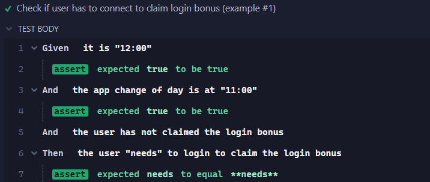
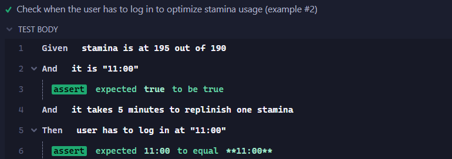
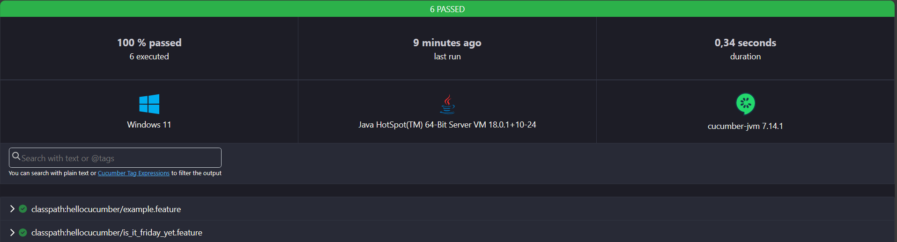
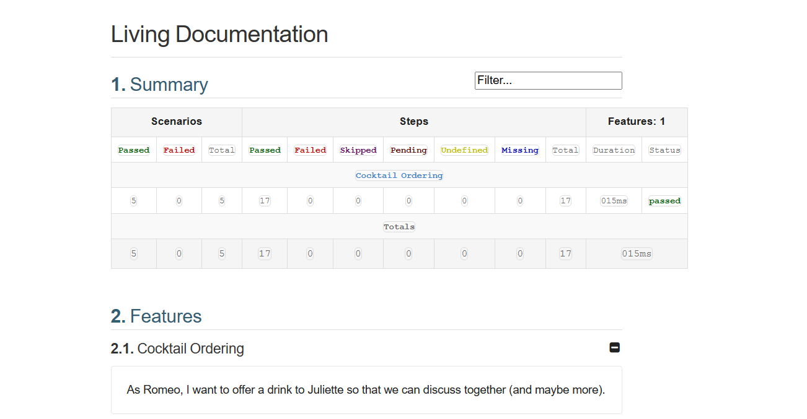
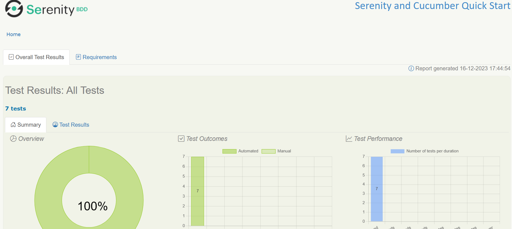

= R5.A.08 -- Dépôt pour les TPs
:icons: font
:MoSCoW: https://fr.wikipedia.org/wiki/M%C3%A9thode_MoSCoW[MoSCoW]

Ce dépôt concerne les rendus de mailto:michele.florio@etu.univ-tlse2.fr[Michele FLORIO].

== TP1

.is_it_friday_yet.feature
[source,gherkin]
---
# language: en
Feature: Is it friday yet ?
    Scenario: Sunday isn't Friday
        Given today is "Sunday"
        When I ask whether it's Friday yet
        Then I should be told "Nope"
    Scenario: Friday is Friday
        Given today is "Friday"
        When I ask whether it's Friday yet
        Then I should be told "TGIF"
    Scenario Outline: asking friday
        Given today is "<day>"
        When I ask whether it's Friday yet
        Then I should be told "<answer>"
        Examples:
            | day            | answer |
            | Friday         | TGIF   |
            | Sunday         | Nope   |
            | anything else! | Nope   |
---

.Résultat de l'exécution des tests
image::assets/tp1.png[width=80%]

== TP2

.order.java
[source,java]
---
package dojo;
import java.util.ArrayList;
import java.util.List;
public class Order {
    private String owner;
    private String target;
    private List<String> cocktails = new ArrayList<String>();
    private String message;
    public void declareOwner(String owner) {
        this.owner = owner;
    }
    public void declareTarget(String target) {
        this.target = target;
    }
    public List<String> getCocktails() {
        return this.cocktails;
    }
    public void setMessage(String message) {
        this.message = message;
    }
    public String getMessage() {
        return "From " + this.owner + " to " + this.target + ": " + this.message;
    }
}
---

.Résultat de l'exécution des tests
image::assets/tp2.png[width=80%]

== TP3

.La feature - cypress\integration\mobileApp.feature
[source, gherkin]
---
# language: en
Feature: Checking if user has to interact with app
Scenario Outline: Check if user has to connect to claim login bonus
    Given it is "<currentTime>"
    And the app change of day is at "<dayChangeTime>"
    And the user <userClaimedState> claimed the login bonus
    Then the user "<userLoginState>" to login to claim the login bonus
    Examples:
        | currentTime | dayChangeTime | userClaimedState | userLoginState |
        | 12:00       | 11:00         | has not          | needs          |
        | 10:00       | 13:00         | has not          | doesn't need   |
        | 16:00       | 08:30         | has              | doesn't need   |
        | 16:20       | 16:30         | has not          | doesn't need   |
Scenario Outline: Check when the user has to log in to optimize stamina usage
    Given stamina is at <actualStamina> out of <totalStamina>
    And it is "<currentTime>"
    And it takes <replinishTime> minutes to replinish one stamina
    Then user has to log in at "<loginTime>"
    Examples:
        | actualStamina | totalStamina | currentTime | replinishTime | loginTime |
        | 140           | 190          | 11:00       | 5             | 15:10     |
        | 195           | 190          | 11:00       | 5             | 11:00     |
        | 45            | 80           | 18:00       | 3             | 19:45     |
---

.L'implémentation des tests - cypress\integration\mobileAppmobileApp.ts
[source, typescript]
import { Given, Then } from "@badeball/cypress-cucumber-preprocessor";
interface Time {
  hour: number,
  minutes: number,
}
// heure actuelle
let currentTime: Time;
// changement de jour pour l'application
let newDayTime: Time;
// est-ce que l'utilisateur a récupérer le bonus de connexion
let claimed: boolean = false;
// Obtenir un objet Time à partir d'une string
const getTimeFromString = (stringTime: string): Time => {
  // sépare la string en deux
  const splitTime = stringTime.split(':');
  // heure = première partie, minutes = deuxième partie
  const time: Time = {
    hour: parseInt(splitTime[0]),
    minutes: parseInt(splitTime[1]),
  }
  return time;
}
// Vérifier le si time1 est plus grand que time2
const checkTimeIsBigger = (time1: Time, time2: Time): boolean => {
  if (time1.hour > time2.hour) {
    return true;
  } else if (time1.hour === time2.hour && time1.minutes >= time2.minutes) {
    return true;
  } else {
    return false;
  }
}
// Vérifier si l'objet Time donné est valide
const checkTimeIsValid = (time: Time): boolean => {
  // si heure comprise entre 00 et 24
  if (time.hour >= 0 && time.hour <= 24) {
    // et minutes comprises entre 00 et 59
    if (time.minutes >= 0 && time.minutes <= 59) {
      // l'objet Time donné est valide
      return true;
    } else {
      return false;
    }
  } else {
    return false;
  }
}
// Vérifier si l'utilisateur doit récupérer le bonus de connexion
const hasToLogIn = (): string => {
  const needToLogIn = (!claimed && checkTimeIsBigger(currentTime, newDayTime));
  return needToLogIn ? 'needs' : "doesn't need";
}
// Il est {heure de format hh:mm}
Given("it is {string}", function (currentHour: string) {
  // on récupère un objet Time
  const time: Time = getTimeFromString(currentHour);
  // on vérifie s'il est valide
  assert.isTrue(checkTimeIsValid(time))
  // si c'est le cas, on l'enregistre pour plus tard
  currentTime = time;
});
// L'appli change de jour à {heure de format hh:mm}
Given("the app change of day is at {string}", function (dayChangeHour: string) {
  // on récupère un objet Time
  const time: Time = getTimeFromString(dayChangeHour);  
  // on vérifie s'il est valide
  assert.isTrue(checkTimeIsValid(time));
  // si c'est le cas, on l'enregistre pour plus tard
  newDayTime = time;
});
// L'utilisateur n'a pas encore récupéré le bonus de connexion
Given("the user has not claimed the login bonus", function () {
  claimed = false;
});
// L'utilisateur à déjà récupéré le bonus de connexion
Given("the user has claimed the login bonus", function () {
  claimed = true;
});
// L'utilisateur {doit|ne doit pas} se connecter
Then("the user {string} to login to claim the login bonus", function (state: string) {
  // on compare le résulat prévu avec le résultat réel
  assert.equal(state, hasToLogIn());
});
let staminaToReplinish = 0;
let replinishRate = 0;
// Obtenir l'heure de connexion à partir de l'énergie qu'il reste à recharger
const getLoginTime = () => {
  // énergie à recharger * le temps de rechargement d'une énergie
  const minutesDuration: number = staminaToReplinish * replinishRate;
  // Récupération de l'heure avec l'ajout d'un zéro devant si seulement un chiffre (ex : 1 => 01)
  const hour: string = (currentTime.hour + Math.floor(minutesDuration / 60)).toString().padStart(2, '0');
  // Récupération des minutes avec l'ajout d'un zéro devant si seulement un chiffre (ex : 4 => 04)
  const minutes: string = (minutesDuration % 60).toString().padStart(2, '0');
  const loginTime: string = `${hour}:${minutes}`;
  return loginTime;
}
// L'énérgie de l'utilisateur est à {énergie actuelle} sur {énergie totale}
Given("stamina is at {int} out of {int}", function (userRemaining: number, userTotal: number) {
  staminaToReplinish = userTotal - userRemaining;
  if (staminaToReplinish < 0) staminaToReplinish = 0;
});
// Il faut {nombre minutes} pour recharger une énergie
Given("it takes {int} minutes to replinish one stamina", function (gameReplinishRate: number) {
  replinishRate = gameReplinishRate;
});
// L'utiliateur doit se connecter à {heure de format hh:mm}
Then("user has to log in at {string}", function (expectedLoginTime: string) {
  // temps de connexion réel
  const loginTime: string = getLoginTime();
  // Si les deux temps sont pareils tout va bien
  assert.equal(loginTime, expectedLoginTime);
});

.Résultat global de l'exécution des tests

.Exemple détaillé scénario 1

.Exemple détaillé scénario 2

.Objectif
L'objectif fixé à ce TP était de faire des tests pour des actions à réaliser pour des jeux mobiles. Ici j'ai retenu deux scénarios (mais j'aurai pu en faire d'autres) :

- Faut-il lancer le jeu pour récupérer le bonus de connexion ?
- Quand faudra-t-il lancer le jeu si l'on souhaite optimiser l'usage d'énergie ?

== TP 4

=== Rapport en txt

.Rapport txt pour cucumber_demo
[source, shell]
---
include::cucumber_demo/report.txt[]
---

=== Rapport en html

.Rapport html pour hellocucumber

=== Rapport cukedoctor

.Extrait rapport cukedoctor pour cucumber_demo https://htmlpreview.github.io/?https://github.com/IUT-Blagnac/r5-a-08-qualdev-RedeiFantasmi/blob/v4.0/assets/rapport_cukedoctor/documentation.html[(appuyer ici pour voir le rapport complet)]

=== Rapport Serenity

.Extrait rapport Serenity pour cucumber_demo https://htmlpreview.github.io/?https://github.com/IUT-Blagnac/r5-a-08-qualdev-RedeiFantasmi/blob/v4.0/assets/rapport_serenity/index.html[(appuyer ici pour voir le rapport complet)]

